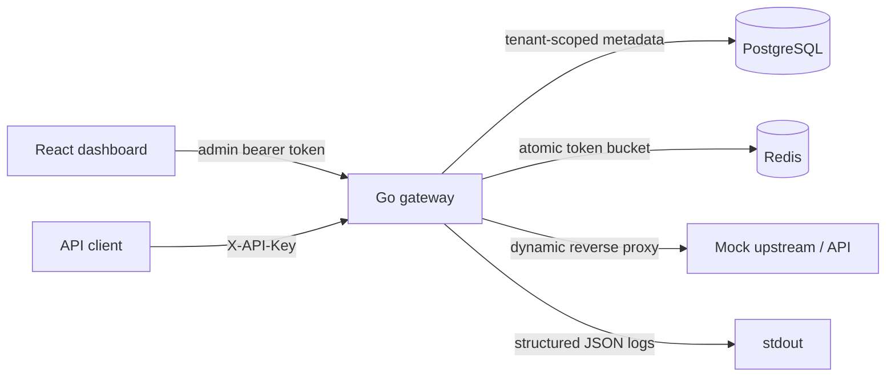

# GateFlow

GateFlow is a local multi-tenant API gateway MVP. It authenticates API clients, resolves tenant-scoped routes, applies local or Redis-backed token-bucket limits, proxies traffic, records safe request metadata, and exposes a React operations dashboard.

## Architecture



Request lifecycle:

1. The gateway creates a request ID and looks up the API client by key prefix.
2. The key hash and active status are verified.
3. The client tenant is used to resolve an active route.
4. Method policy and the client/route rate-limit policy are checked.
5. Redis atomically refills and consumes a token, or the local mutex bucket is used without Redis.
6. The request is forwarded without `X-API-Key` or `Authorization` headers.
7. Status, latency, tenant, client, route, blocked state, and request ID are persisted.

## Stack

- Go 1.22, `net/http`, `httputil.ReverseProxy`, `log/slog`
- PostgreSQL 16 for tenants, clients, routes, policies, and request logs
- Redis 7 with an atomic Lua token-bucket script
- React, TypeScript, Vite, TanStack Query, Recharts, Lucide
- Docker Compose and GitHub Actions

## Local setup

Prerequisites: Go 1.22+, Node 20+, npm 10+, and Docker Desktop.

```powershell
Copy-Item .env.example .env
docker compose up --build
```

Open the dashboard at `http://localhost:5173`. The gateway is at `http://localhost:8080` and the mock upstream is at `http://localhost:9090`.

The default local values are:

- Admin token: `gateflow-local-admin`
- Tenant ID: `local-tenant`
- Demo API key: `gf_local_demo_key`

Set `ADMIN_TOKEN` and `SEED_API_KEY` in `.env` for a different local installation. These values are development defaults only.

Without Docker, run PostgreSQL and Redis separately, then start:

```powershell
cd backend
go run ./cmd/mockupstream
go run ./cmd/gateway
cd ..\frontend
npm ci
npm run dev
```

With `DATABASE_URL` and `REDIS_URL` unset, the gateway uses in-memory storage and a local token bucket, which is useful for fast unit tests.

## API endpoints

Administrative endpoints require `Authorization: Bearer $ADMIN_TOKEN` and are tenant-scoped with `X-Tenant-ID`.

- `POST /api/tenants`
- `GET, POST /api/clients`
- `POST /api/clients/{id}/rotate-key`
- `PATCH /api/clients/{id}/revoke`
- `PATCH /api/clients/{id}/activate`
- `PATCH /api/clients/{id}/rate-limit`
- `GET, POST /api/routes`
- `PATCH, DELETE /api/routes/{id}`
- `GET /api/analytics/summary`
- `GET /api/analytics/traffic`
- `GET /api/analytics/logs`
- `GET /health`
- `GET /readyz` or `GET /ready`

Gateway traffic uses `X-API-Key` and a configured route, for example:

```powershell
curl.exe http://localhost:8080/gateway/products -H "X-API-Key: gf_local_demo_key"
```

The seeded `/gateway` route forwards `/gateway/products` to the mock upstream's `/products` endpoint. The default client has a capacity of five tokens and refills at one token per second:

```powershell
.\scripts\demo.ps1
```

## Security decisions

Raw API keys are returned only on creation or rotation. The database stores a prefix and SHA-256 digest of a cryptographically random 256-bit key; raw keys are never logged or proxied upstream. Admin APIs require a local bearer token and an existing `X-Tenant-ID`; repositories enforce that tenant boundary. Route URLs accept only HTTP(S) URLs with a host and production rejects private, loopback, link-local, and metadata destinations. Request bodies are capped at 1 MiB for JSON admin requests, and server/upstream timeouts are configured.

This is a local MVP. Before production, replace the local admin token with OIDC/JWT and RBAC, add stronger SSRF egress policy, TLS, secret management, rate-limit policy administration, and operational alerting.

## Database model

`tenants` owns `api_clients`, `gateway_routes`, `rate_limit_policies`, and `request_logs`. Foreign keys and tenant-scoped repository queries prevent cross-tenant reads. Migrations are in `backend/migrations/001_init.sql`; raw API keys are intentionally absent from the schema.

## Testing

```powershell
cd backend
go test ./...
go vet ./...
cd ..\frontend
npm ci
npm run lint
npm test -- --run
npm run build
cd ..
docker compose config
```

The GitHub Actions workflow runs backend formatting, vet, tests, and build; frontend lint, tests, and production build; and Compose configuration validation.

## Repository layout

- `backend/cmd/gateway`: gateway executable and graceful shutdown
- `backend/cmd/mockupstream`: local upstream service
- `backend/internal/httpapi`: admin APIs, analytics, dynamic proxy lifecycle
- `backend/internal/storage`: memory and PostgreSQL repositories
- `backend/internal/ratelimit`: token bucket and Redis Lua limiter
- `backend/migrations`: PostgreSQL schema and indexes
- `frontend/src`: dashboard source and API client
- `docker-compose.yml`: local five-service stack
- `scripts/demo.ps1`: interview/demo request flow

## Future AWS mapping

The local boundaries map directly to ECR images, ECS Fargate services, RDS PostgreSQL, ElastiCache Redis, CloudWatch logs/metrics, Secrets Manager, an Application Load Balancer, and GitHub Actions using AWS OIDC. AWS deployment is intentionally not part of this MVP.
